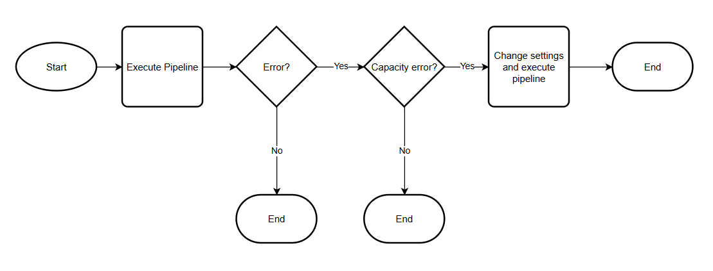
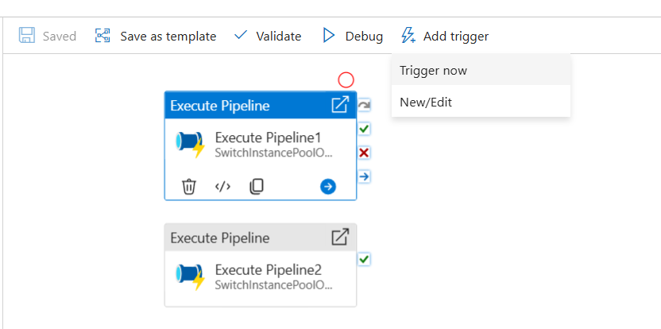
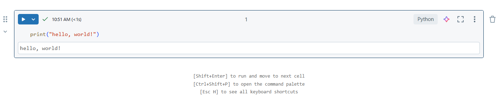
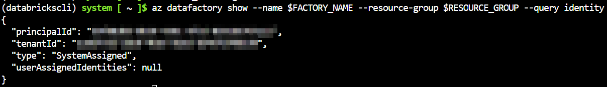
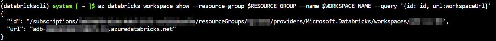
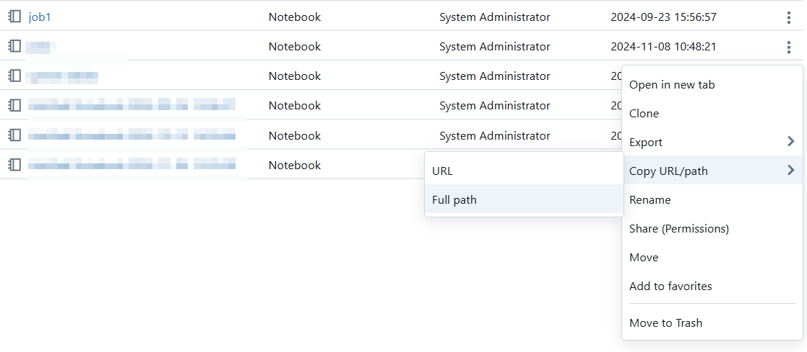

# Reacting to capacity-related errors in Databricks clusters via ADF Pipelines

## Overview

The basic pattern for these piplelines is as follows.

1. The pipeline will attempt to run the Databricks notebook activity.
2. If an error occurs, the pipeline will inspect the error message to see if it matches a configured list of errors that are considered "capacity" related.
3. If an error is determined to be capacity related, the pipeline will run a Databricks notebook task with a different configuration. Depending on the scenario, it will either simply change the instance pool id on the linked service, or it will use a different linked service in order to swtich from an ad hoc job cluster to an instance pool.



## Running the samples

You can run the pipelines manually from the ADF Studio or via the Azure CLI. The pipelines in the "Helpers" folder are parameterized and have "wrapper" pipelines in the root folder to simplify execution. To further simplify execution and to avoid duplication of configuration, the wrapper pipelines default all of their parameters to values configured in global parameters. If you have set all of your global parameters (see the [setup](#setup) section below) then you can simply trigger the wrapper pipelines via Add trigger / Trigger now.



Or you can trigger and monitor via the Azure CLI like so:

```bash
FACTORY_NAME=<YOUR-FACTORY-NAME>
RESOURCE_GROUP=<YOUR-RESOURCE_GROUP>

RUN_ID=$(az datafactory pipeline create-run --factory-name $FACTORY_NAME --resource-group $RESOURCE_GROUP --pipeline-name pipeline1 | jq -r .runId)
az datafactory pipeline-run show --factory-name $FACTORY_NAME --resource-group $RESOURCE_GROUP --run-id $RUN_ID
```

There are two approaches demonstrated here.

1. tryJobPoolThenFallbackOnOdcrInstancePool -- This pipeline will first run the notebook using an ad hoc job cluster. If a failure is determined to be capacity related, it will attempt to re-run using an instance pool. The assumption is that the instance pool is tagged to use an On-demand Capacity Reservation Group.

2. tryNonDdcrInstancePoolThenFallbackOnOdcrInstancePool -- This pipeline will first run the notebook using an instance pool that is assumed to not be tagged to use an On-demand Capacity Reservation Group. If a failure is determined to be capacity related, it will attempt to re-run using an instance pool that is assumed to be tagged to use an On-demand Capacity Reservation Group.

## Setup

### 1 - Fork this repo into your own GitHub or Azure DevOps repo

### 2 - Create / update Databricks Workspace

You'll need a workspace that has 2 [instance pools](https://learn.microsoft.com/en-us/azure/databricks/compute/pool-index) and a notebook. The notebook can do whatever you want, as long as it runs without error. Ths following is enough for our purposes.



### 3 - Create a factory json file and update global parameters

You can use the [template](./factory/factory.json) in the factory folder in this repo as a starting point. Be sure to update the factory name as well as all of the global parameter values.

You can get your Data Factory identity info via the following command.

```bash
FACTORY_NAME=<YOUR-FACTORY-NAME>
RESOURCE_GROUP=<YOUR-RESOURCE_GROUP>
az datafactory show --name $FACTORY_NAME --resource-group $RESOURCE_GROUP --query identity
```



You can get your workspace resourceid and url via the following command. Make sure to append "https://" to the url in the factory json file.

```bash
WORKSPACE_NAME=<YOUR-WORKSPACE-NAME>
RESOURCE_GROUP=<YOUR-RESOURCE_GROUP>
az databricks workspace show --resource-group $RESOURCE_GROUP --name $WORKSPACE_NAME --query '{id: id, url:workspaceUrl}'
```



You can get the url for your Databricks notebook from the Control Plane UI:



### 4 - Connect Data Factory to your repo

You can do this in the Data Factory Studio, or via the Azure CLI.

```bash
FACTORY_NAME=<YOUR-FACTORY-NAME>
RESOURCE_GROUP=<YOUR-RESOURCE_GROUP>
GITHUB_ACCOUNT_NAME=<YOUR-GITHUB-ACCOUNT-NAME>
GITHUB_REPO_NAME=<YOUR-GITHUB-REPO-NAME>
COLLAB_BRANCH_NAME=<YOUR-BRANCH-NAME>

FACTORY_INFO=$(az datafactory show --factory-name $FACTORY_NAME --resource-group=$RESOURCE_GROUP)

az datafactory configure-factory-repo --factory-resource-id=$(echo $FACTORY_INFO | jq -r .id) --location $(echo $FACTORY_INFO | jq -r .location) --factory-git-hub-configuration  account-name=$GITHUB_ACCOUNT_NAME repository-name=$GITHUB_REPO_NAME collaboration-branch=$COLLAB_BRANCH_NAME root-folder=/
```

If you want to use Azure DevOps instead of GitHub, refer to the documentation here: [learn.microsoft.com](https://learn.microsoft.com/en-us/cli/azure/datafactory?view=azure-cli-latest#az-datafactory-configure-factory-repo)

### 5 - Add the ADF Managed Identity to the Databricks Workspace and add it to the admins group

You can do this using the Databricks control plane UI or via the Azure / Databricks CLIs. The following example assumes that you're running on Linux / WSL, you have a profile pointing to your Databricks workspace set up in your .databrickscfg file and that you are using Azure CLI authentication for the Databricks CLI. Obviously you can adjust things as necessary to fit your environment and preferences.

```bash
PROFILE=<YOUR-PROFILE-NAME>
FACTORY_NAME=<YOUR-FACTORY-NAME>
RESOURCE_GROUP=<YOUR-RESOURCE_GROUP>

ADF_APP_ID=$(az ad sp show --id $(az datafactory show --resource-group $RESOURCE_GROUP --factory-name $FACTORY_NAME | jq -r .identity.principalId) --query appId --output tsv)
databricks service-principals create --application-id $ADF_APP_ID --display-name $FACTORY_NAME --profile $PROFILE
SERVICE_PRINCIPAL_ID=$(databricks service-principals list --profile $PROFILE --output json | jq --arg jq_var "$FACTORY_NAME" -r '.[] | select(.displayName == $jq_var) | .id')
GROUP_ID=$(databricks groups list --profile $PROFILE --output json | jq -r '.[] | select(.displayName == "admins") | .id')
JSON=$(echo '{
  "schemas": [
    "urn:ietf:params:scim:api:messages:2.0:PatchOp"
    ],
  "Operations": [
    {
      "path": "members",
      "op": "add",
      "value": [
        {
          "value": "$user_id"
        }
      ]
    }
  ]
}' | sed 's/\$user_id/'$SERVICE_PRINCIPAL_ID'/')
databricks groups patch $GROUP_ID --profile $PROFILE --json $JSON
```
